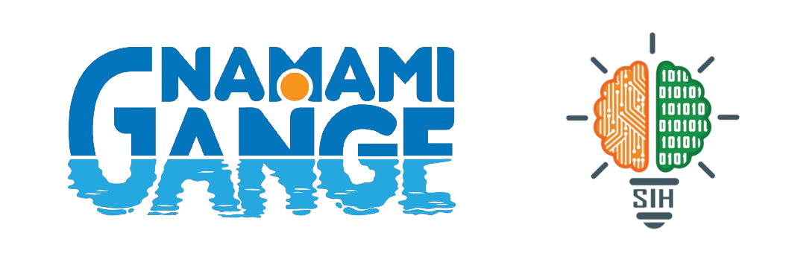
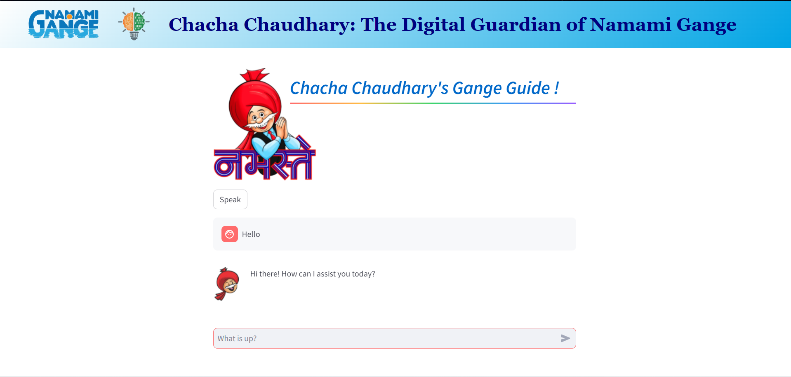
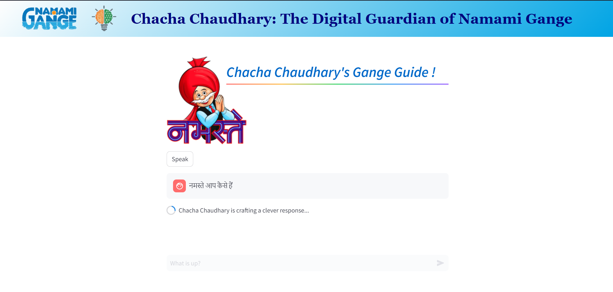
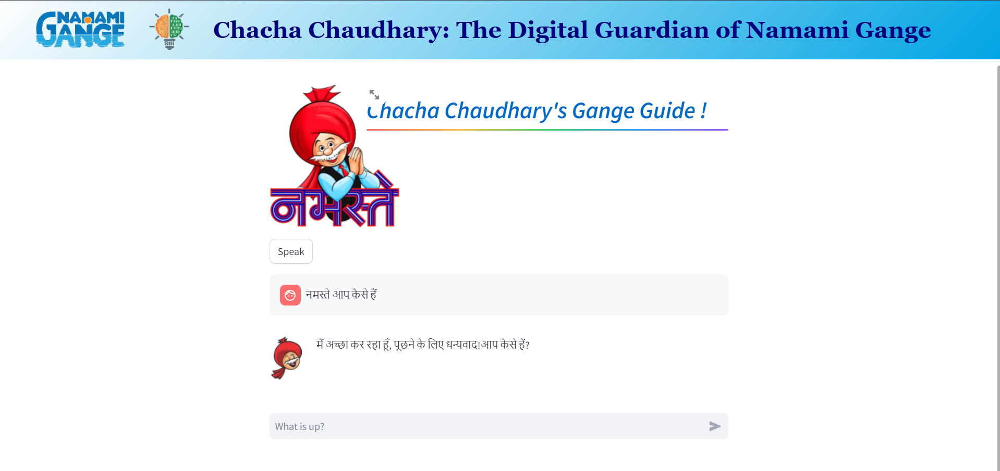
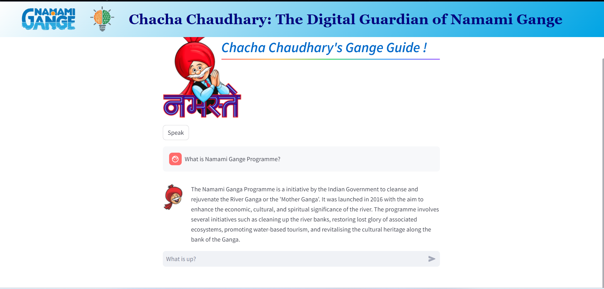

# Chacha-Chaudhary : The Digital Guardian of Namami Gange

Chacha Chaudhary: The Digital Guardian of Namami Gange is an interactive chatbot project leveraging the iconic Indian comic character to provide information and assistance regarding the Namami Gange initiative, promoting awareness and engagement through voice and text interactions

## Features

- ***AI-Powered Robot Mascot***: 
  - An interactive robot using advanced AI, ML, and Chatbot technologies.
  - Equipped with a touch panel for seamless user interaction.
  - Provides real-time information and guidance in the River Basin War Room & Ganga Museum.

- ***Digital Avatar for Online Engagement***: 
  - A digital version of Chacha Chaudhary to engage users via the NMCG website.
  - Expands the reach of the Namami Gange initiative through online dissemination.

- ***Interactive Navigation***:
  - The robot mascot will guide visitors through the various components of the Namami Gange program in physical locations.
  - Enhances the educational experience with interactive learning modules.

- ***Focus on Behavioral Change***:
  - Designed to foster positive behavioral changes regarding riverine ecology.
  - Engages diverse stakeholders, especially school children, to create a lasting impact.

- ***Voice Typing and Voice Answering***:
  - Supports voice typing for user inputs, making interaction more natural and user-friendly.
  - The robot can answer questions and provide information through voice responses.

- ***Hindi and English Language Support***:
  - Supports both Hindi and English languages to cater to a broader audience.
  - Ensures accessibility and inclusivity for users from different linguistic backgrounds.
 
  ## Screenshots

## Future Scope

- ***Enhanced AI Capabilities***:
  - Incorporate more advanced AI features for improved interaction and user experience.
  - Develop natural language processing (NLP) capabilities to support multiple languages and dialects for broader reach.

- ***Expanded Digital Presence***:
  - Enhance the digital avatar with more interactive features and content.
  - Integrate with social media platforms to increase visibility and engagement.

- ***Mobile Application***:
  - Develop a mobile app to complement the physical and digital versions of Chacha Chaudhary.
  - Provide interactive educational content and real-time updates about the Namami Gange Programme.

- ***Collaborations and Partnerships***:
  - Partner with more educational institutions and organizations to expand the project's reach.
  - Collaborate with technology companies to leverage the latest advancements in AI and robotics.

- ***Regular Updates and Maintenance***:
  - Ensure the robot mascot and digital avatar are regularly updated with the latest information and features.
  - Conduct periodic maintenance and user feedback sessions to continuously improve the project.

